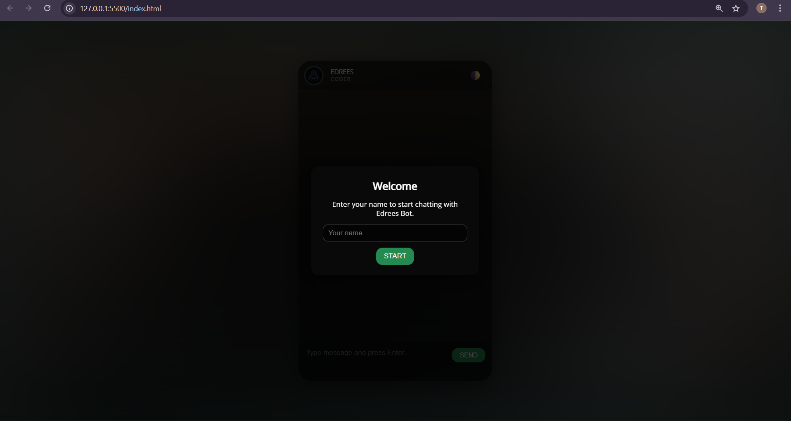
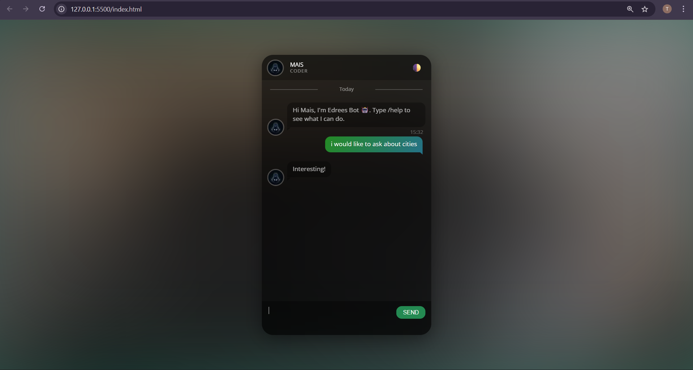
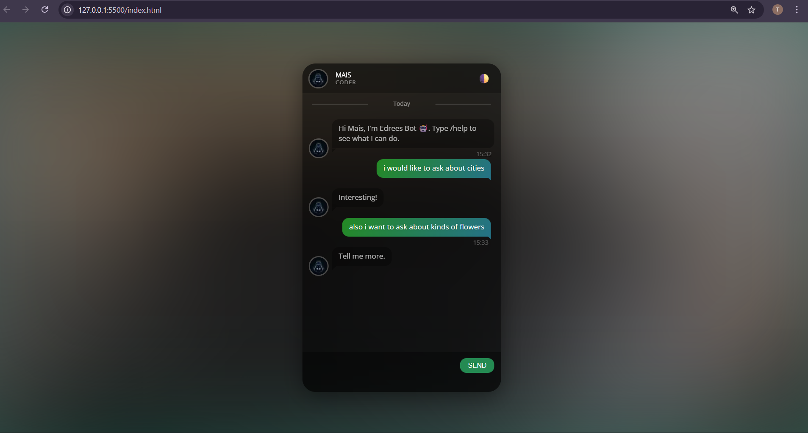

# Edrees-Fake-Chat-App

---

## 📷 Preview

### Welcome Screen



---

### Chat Page (Dark Theme)



---

### Chat Page (Neon Theme)



---
## 🎯 Overview

A modern, single-page **fake chat interface** built with HTML, CSS and JavaScript.  
This project simulates a conversation between the user and **Edrees Bot** and is mainly designed to showcase:

- Clean UI design
- Front-end JavaScript logic
- Simple state handling (theme persistence)
- Custom mini “assistant” behavior with commands

> 💬 The app is completely front-end – no backend server and no real network requests.

---

## 🎯 Main Features

### 👤 Name Overlay on Every Load
- When you open or refresh the page, a **welcome overlay** appears.
- You enter your **name**, and it is displayed in the chat header.
- The conversation always starts **fresh** with a greeting like:  
  `Hi Mais, I'm Edrees Bot 🤖. Type /help to see what I can do.`
- The name is **not stored** after the session ends – you enter it again each time.

### 🌓 Theme Switcher (Dark / Neon) with Persistence
- A small **🌓 icon** in the chat header toggles between:
  - `Dark` theme
  - `Neon` theme
- The chosen theme is saved using `localStorage`, so it is **remembered** on the next visit.

### ⌨️ Typing Speed Indicator
- While typing in the message box, the app measures:
  - **Typing speed** (characters per second).
- Shown in a small text under the input:
  - `Typing speed: 3.4 chars/sec`
- It resets automatically when the message is sent or the input is cleared.

### 🤖 Edrees Bot – Simple Assistant Behavior

The bot responds in two ways:

1. **Keyword-based replies**  
   Some example triggers:
   - `who are you`, `kimsin` → bot introduces itself  
   - `project`, `proje` → explains the purpose of this project  
   - `github` → sends the GitHub profile link  
   - `hello`, `hi`, `selam` → friendly greeting  
   - `thanks`, `teşekkür` → polite response  
   - `bye`, `görüşürüz` → goodbye message  
   - If no keywords match, the bot uses a **fallback list** of phrases like “Interesting!”, “Tell me more.”, etc.

2. **Slash commands** (start with `/`):  
   - `/help` – list available commands  
   - `/about` – short description of Edrees Bot  
   - `/github` – link to the creator’s GitHub profile  
   - `/skills` – small list of skills / technologies

Commands are answered immediately; normal messages show a **“Edrees is typing…”** bubble with animated dots before the reply.

### 📅 Timestamps & Date Separators
- Messages include a **time stamp** in `HH:MM` format.
- When the date changes, the app inserts a **date separator**:
  - `Today`
  - `Yesterday`
  - or the full local date (e.g. `12/5/2025`).

### 🎨 UI & Animations
- Glass-like chat card with rounded corners and drop shadow.
- Background uses a blurred image (`logo.jpg`) with a soft gradient.
- Chat window has a **fade-in up** animation on load.
- Messages pop in with a **bounce** animation.
- Bot typing bubble shows three animated dots and “Edrees is typing…” label.

---

## 🛠 Technologies Used

- **HTML5**
- **CSS3**
  - Flexbox layout
  - Gradients & blur
  - Transitions & keyframe animations
- **JavaScript**
  - DOM manipulation (with jQuery)
  - Basic input handling and timing logic
  - `localStorage` (for theme persistence only)
- **External Libraries**
  - [Normalize.css](https://necolas.github.io/normalize.css/) – cross-browser reset
  - Google Fonts – _Open Sans_
  - [malihu Custom Scrollbar](http://manos.malihu.gr/jquery-custom-content-scroller/) – custom scrollbars
  - jQuery

---

## 📁 Project Structure

```text
.
├── index.html       # Main HTML page and layout structure
├── style.css        # Styling, themes, and animations
├── index.js         # Chat logic and bot behavior
├── fox.webp         # Avatar image used for Edrees Bot
├── logo.jpg         # Background image used for blurred gradient effect
└── images/          # (Optional) Extra screenshots or assets

```


